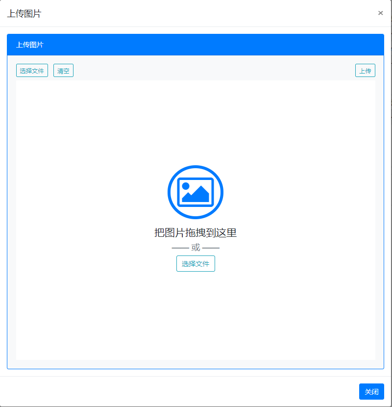

# vue-upload
vue 上传组件

[demo](http://zengde.github.io/vue/#/upload)

# 截图



# 使用
``` javascript
components:{
    Upload: () => import('Upload.js'),
},
template:`<div>
<keep-alive>
    <Upload ref="galleryUploadCom" :posturl="galleryUploadUrl" type='image' inputid='filedata_image' @uploadAll='challs_flash_onCompleteAll'></Upload>
</keep-alive>
</div>`
```

# props
| 属性	| 类型	| 描述 |
| - | :- | :- | 
|posturl	| String	| 	上传地址 |
|type	| String	| 	(image,video,file) |
|inputid	| String	| 	多个上传组件时需设置id |


# events
|事件	|参数	|描述|
| - | :- | :- | 
|uploadAll	|`id` 分类id	|	上传完成事件|

# refrence
[vue-upload-component](https://github.com/lian-yue/vue-upload-component)